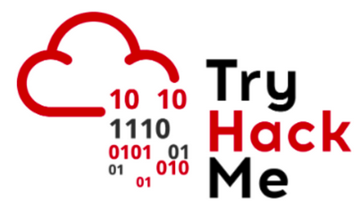

# TryHackMe — CyberHeros Write‑up


---

## **Initial Recon**

I started with an **Nmap scan** to identify open ports and services:

```
nmap -sV 10.201.112.182
```

**Result:**

* Port **80/tcp** open
* Service: **Apache/2.4.48 (Ubuntu)**

This confirmed **a web server was running.**

## HTTP Analysis

Accessing the main site (`http://10.201.112.182`) revealed a page called  **CyberHeros** , with the message:

> “Join our forces, find the vuln on our login page and login to join us.”

Clearly, the challenge was pointing towards the  **login page** .

## Directory Enumeration

I used **Gobuster** to enumerate hidden directories and files:

```
gobuster dir -u http://10.201.112.182 -w /usr/share/wordlists/dirb/big.txt
```

**Findings:**

* `/.htaccess` → 403 Forbidden

## Credentials discovered:

* **Username:** `h3ck3rBoi`
* **Password:** `SuperSecret@12345` (the reverse of `"54321@terceSrepuS"`)
* `/.htpasswd` → 403 Forbidden
* `/assets/` → directory listing enabled (css, js, img, vendor)
* `/server-status` → 403 Forbidden

This indicated sensitive files existed but were protected, and that directory listing was enabled a misconfiguration.

## Login Page

Acessing the  **login.html** :

```
curl -L http://10.201.112.182/login.html
```

Inspecting the source code revealed the authentication logic **inside JavaScript:**

```
if (a.value=="h3ck3rBoi" & b.value==RevereString("54321@terceSrepuS")) {
   xhttp.open("GET", "RandomLo0o0o0o0o0o0o0o0o0o0gpath12345_Flag_"+a.value+"_"+b.value+".txt", true);
   xhttp.send();
}
```

## Credentials discovered:

* **Username:** `h3ck3rBoi`
* **Password:** `SuperSecret@12345` (the reverse of `"54321@terceSrepuS"`)

## Flag

* `h3ck3rBoi`
* `SuperSecret@12345`

## **Conclusion**

The attack path was:

1. **Nmap** → identify open port 80.
2. **Gobuster** → enumerate directories and files.
3. **Login.html** → inspect JavaScript and find hardcoded credentials.
4. **Access hidden file** → obtain the flag.

## Vulnerabilities:

* **Hardcoded credentials in client‑side JavaScript** → anyone inspecting the code can log in.
* **Directory listing enabled** → unnecessary exposure of files.

---

[](https://medium.com/@andreymsdev/tryhackme-cyberheros-write-up-13cf0474cdb6)
[](https://tryhackme.com/p/Tux10)
# TryHackMe-CyberHeros-Write-up
